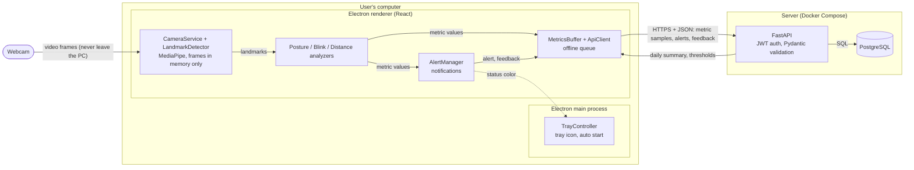

# Architecture (SW-016)

This document shows the parts of SitWise, where each part runs, and what data moves between them. The camera image stays on the user's computer. Only the numbers defined in `docs/api/contract.md` go to the server (NFR-01, ADR-002).

## 1. Component Diagram

**How to read it**

- Solid boxes are parts we write. The rounded box is the webcam; the cylinder is the database.
- The webcam arrow ends inside the user's computer. No arrow carries an image to the server.
- The only arrow that crosses to the server carries JSON numbers over HTTPS.
- The dotted arrow is an internal message from the renderer to the main process (Electron IPC).

## 2. What Runs Where (Deployment)

| Node | Runs | Technology | Notes |
|------|------|------------|-------|
| User's computer | Desktop client | Electron + React + Vite + TypeScript, MediaPipe Tasks | Windows 10/11 (NFR-06), macOS optional. Tray icon, background work, auto start (ADR-001). |
| Server | REST API | Python + FastAPI | JWT auth, passwords hashed (NFR-04). Started with Docker Compose. |
| Server | Database | PostgreSQL | Tables from roadmap section 4.5. |

## 3. Data Between Client and Server

| Client sends / reads | Endpoint | Stored in |
|----------------------|----------|-----------|
| Register, log in | `POST /auth/register`, `POST /auth/login` | `users` |
| Calibration profile | `POST /calibration`, `GET /calibration/latest` | `calibration_profiles` |
| Session start / end | `POST /sessions`, `PATCH /sessions/{id}` | `sessions` |
| Metric samples (10 s summaries) | `POST /metrics` | `metric_samples` |
| Alerts | `POST /alerts` | `alerts` |
| "False alert" feedback | `POST /feedback` | `alert_feedback` |
| Daily summary | `GET /summary/daily` | `daily_summaries` |
| Personal thresholds | `GET /thresholds` | `user_thresholds` |

Message shapes are defined in `docs/api/contract.md` (SW-010). None of them contains an image.

## 4. Related Decisions

- [ADR-001: Electron desktop app](../adr/ADR-001-electron.md)
- [ADR-002: Local image processing](../adr/ADR-002-local-processing.md)
