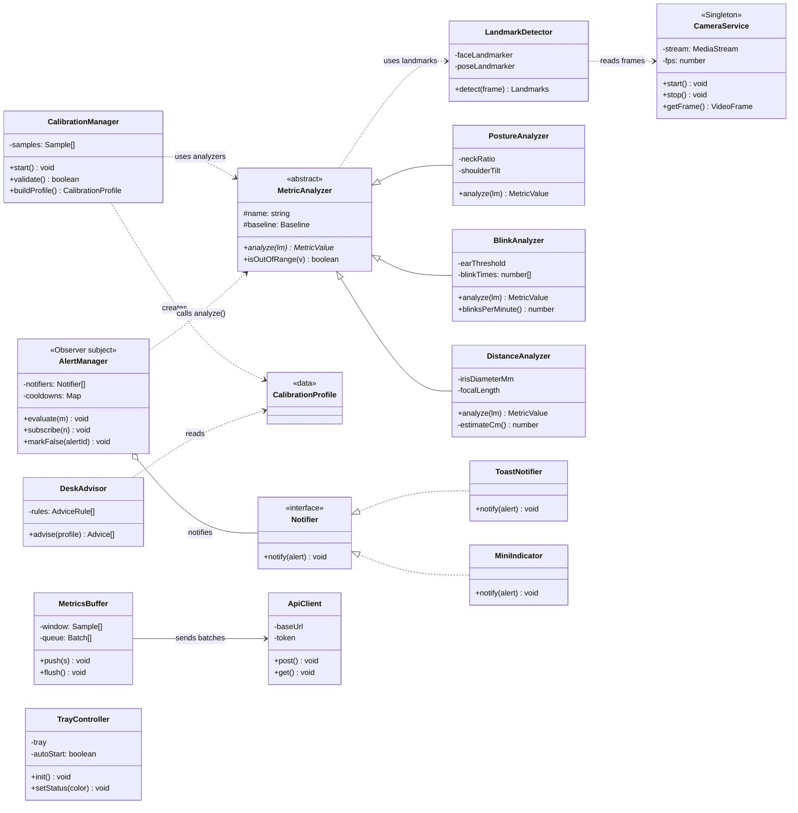

# Client Class Diagram (SW-013)

This document shows the main classes of the desktop client (Electron + React + TypeScript) and how they work together. It follows section 4.3 of the roadmap. The server side is in `class-server.md` (SW-014).

Visibility: `-` private, `+` public, `#` protected.

## 1. Diagram

**How to read the arrows**

- `<|--` inheritance: the subclass extends the parent class.
- `<|..` implementation: the class implements the interface.
- `o--` aggregation: AlertManager holds a list of Notifiers.
- `-->` association: MetricsBuffer keeps and uses an ApiClient.
- `..>` dependency: the class uses the other one for a task.

TrayController has no arrow. It runs in the Electron main process; the other classes run in the renderer process.

## 2. Class Table

| Class | Type | Responsibility | Relations |
|-------|------|----------------|-----------|
| CameraService | Class (Singleton) | Opens the webcam once and gives frames to the app. | LandmarkDetector reads its frames. |
| LandmarkDetector | Class | Runs MediaPipe FaceLandmarker and PoseLandmarker on a frame. | Depends on CameraService. |
| MetricAnalyzer | Abstract class | Common base for all analyzers: compares a value with the user's baseline. | Parent of the 3 analyzers. |
| PostureAnalyzer | Subclass | Calculates neck ratio and shoulder tilt. | Extends MetricAnalyzer. |
| BlinkAnalyzer | Subclass | Detects blinks (EAR) and counts blinks per minute. | Extends MetricAnalyzer. |
| DistanceAnalyzer | Subclass | Estimates screen distance in cm from the iris size. | Extends MetricAnalyzer. |
| CalibrationManager | Class | Collects 5 s of samples, rejects a bad calibration, builds the profile. | Uses the analyzers, creates CalibrationProfile. |
| CalibrationProfile | Data class | The user's personal baseline values. | Created by CalibrationManager, read by DeskAdvisor. |
| DeskAdvisor | Class | Gives desk setup advice (e.g. "raise the screen"). | Reads CalibrationProfile. |
| AlertManager | Class (Observer subject) | Decides when to alert, applies cooldowns, records false alerts. | Calls `analyze()` on every analyzer; notifies all Notifiers. |
| Notifier | Interface | One way to show an alert to the user. | Implemented by ToastNotifier and MiniIndicator. |
| ToastNotifier | Class | Shows a system notification. | Implements Notifier. |
| MiniIndicator | Class | Shows the always-on-top green/yellow/red indicator. | Implements Notifier. |
| MetricsBuffer | Class | Builds 10 s summaries and queues them when there is no internet. | Sends batches with ApiClient. |
| ApiClient | Class | Sends HTTP requests to the server with the JWT token. | Used by MetricsBuffer. |
| TrayController | Class | Tray icon, status color, auto start. | Runs in the Electron main process. |

## 3. OOP Principles and Patterns

| Principle / pattern | Where |
|---------------------|-------|
| Encapsulation | Camera stream and thresholds are private; only methods are public. |
| Inheritance | PostureAnalyzer, BlinkAnalyzer, DistanceAnalyzer → MetricAnalyzer |
| Polymorphism | AlertManager calls the same `analyze()` on every analyzer. |
| Abstraction | Notifier interface, MetricAnalyzer abstract class |
| Singleton | CameraService: the camera is opened only once. |
| Observer | AlertManager → ToastNotifier, MiniIndicator |

This is version 1. It will be updated when the code changes (Definition of Done, item 3).
