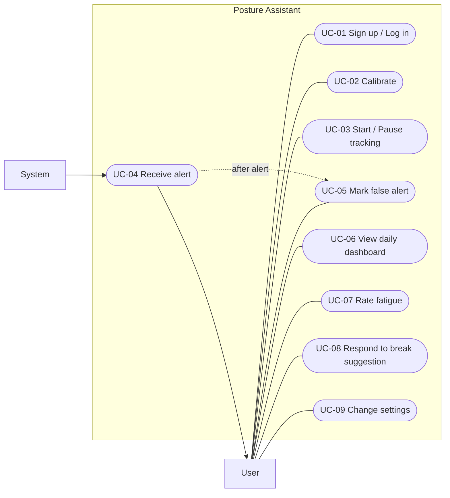

# Use Case Diagram (SW-012)

This document shows what the user does with the posture assistant app and which tasks the system is part of. Use case IDs follow the roadmap (UC-01 to UC-09).

## 1. Diagram

**Notes**

- Solid lines: the user starts the use case.
- UC-04 arrow goes from the System to the User: the system sends the alert.
- Dotted arrow: UC-05 can only happen after UC-04.

## 2. Use Case Table

| ID | Use case | Actor | Precondition | Main flow | Result |
|----|----------|-------|--------------|-----------|--------|
| UC-01 | Sign up / Log in | User | App is installed | 1. User opens the app. 2. User enters email and password. 3. System checks the data. | User is logged in. |
| UC-02 | Calibrate | User | User is logged in, camera is available | 1. User sits in a correct posture. 2. User starts calibration. 3. System saves the reference posture. | Reference posture is saved. |
| UC-03 | Start / Pause tracking | User | Calibration is done | 1. User presses Start or Pause. 2. System starts or stops posture tracking. | Tracking is on or paused. |
| UC-04 | Receive alert | System → User | Tracking is on | 1. System detects bad posture. 2. System sends an alert to the user. | User is warned. |
| UC-05 | Mark false alert | User | UC-04 has happened | 1. User sees the alert. 2. User marks it as false. 3. System saves the feedback. | Alert is recorded as false. |
| UC-06 | View daily dashboard | User | User is logged in | 1. User opens the dashboard. 2. System shows the day's posture data. | User sees daily statistics. |
| UC-07 | Rate fatigue | User | User is logged in | 1. User opens the fatigue form. 2. User gives a score. 3. System saves it. | Fatigue score is saved. |
| UC-08 | Respond to break suggestion | User | System has suggested a break | 1. User sees the suggestion. 2. User accepts or postpones it. 3. System saves the answer. | Break is started or postponed. |
| UC-09 | Change settings | User | User is logged in | 1. User opens settings. 2. User changes options. 3. System saves them. | New settings are active. |
